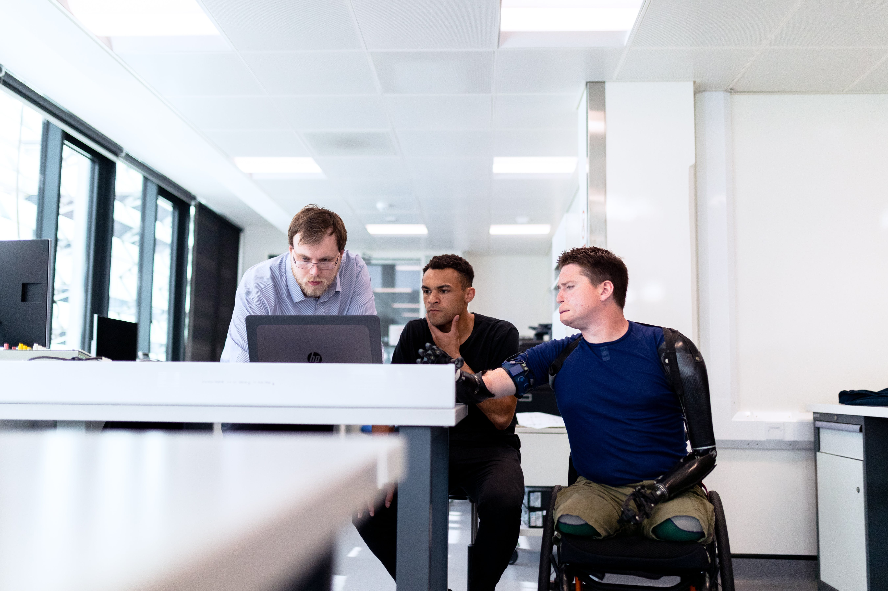

# Introduction to Web accessibility

This article explores the importance of web accessibility, covering its definition, impact on society, and the benefits of creating accessible web experiences. It also delves into diverse ways of web interaction, common disabilities and, assistive technologies.

## What is Accessibility

Web Accessibility is the practice of ensuring that websites are usable by people of all abilities and disabilities. It is a broad topic that covers a wide range of disabilities, including visual, auditory, physical, speech, cognitive, language, learning, and neurological disabilities.

Approximately 15% of the world's population has some form of disability. And they use the web using a variety of assistive technologies, such as screen readers, screen magnifiers, speech recognition software, alternative input devices, and more.

Society often overlooks people with disabilities, but the costs of an inaccessible web are significant for everyone. Consider the impact on individuals who may not have disabilities themselves but are connected to someone who does. Inaccessible websites can hinder opportunities in employment, education, and access to vital information (e.g., during the Covid-19 pandemic).

**The cost of an inaccessible web is significant for everyone.**
Most of us will experience some form of disability at some point in our lives. For example, we may have a temporary disability, such as a broken arm, or a permanent disability, such as a visual impairment. As we age, we may experience age-related disabilities, such as arthritis or hearing loss. And as we grow older, we may experience cognitive disabilities, such as memory loss. Even a father holding a baby in one arm while using a mobile phone with the other trying to book a medical appointment is a form of temporary disability.

In the context of **Dotcontrol**, we can be Accessibility Heroes by having a good understanding of the Web Accessibility. And so doing our best to create digital products that everyone use and enjoy, including people with disabilities, can use and contribute to the Web.

**Some Statistics.**

In the Netherlands there are around two million people that have a disability. In Curacao with a population of around 1500 citizens there are around 10,000 people that have a disability.

In the United States, the statistics are as follows:

- 26 percent (one in 4) of adults in the United States have some type of disability.
- 2 in 5 adults age 65 years and older have a disability
- 20 percent of people in the US (48 million people) report some degree of hearing loss, and 29 million of them could benefit from using hearing aids.
- 2.3 percent of people in the US (7 million people) report having a visual disability, and 1 million people in the US are legally blind.
- 16 percent of people in the US (39 million people) have difficulties with their physical functioning. 17.1 million people would find it very difficult or impossible to walk unassisted for a quarter mile.
- Roughly 8 million people in the US have an intellectual disability, including 425,000 children.

If you think about it, it is a large group of intelligent, carrying people that can bring new ideas, new perspectives, and new opportunities to our society. A large group of people that would like to be developers, designers or content creators but that are not getting that opportunity and we can help them.
